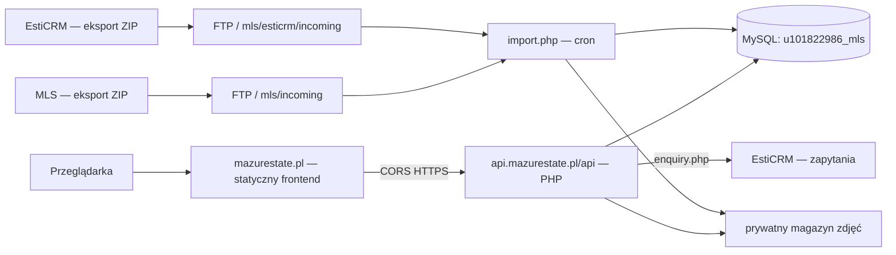
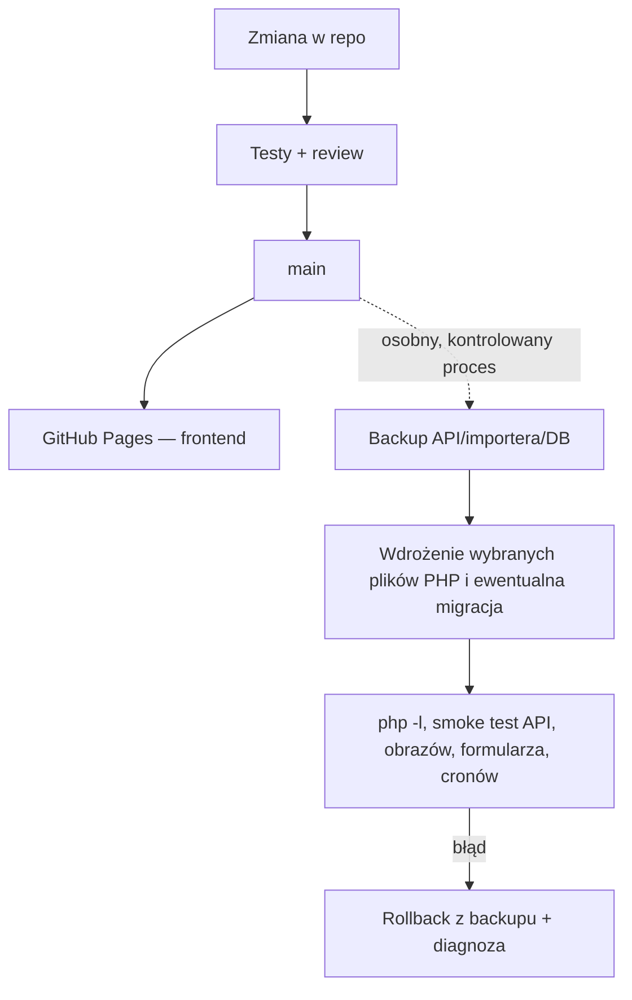
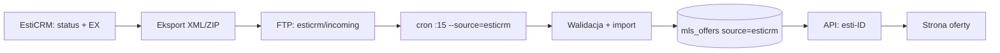
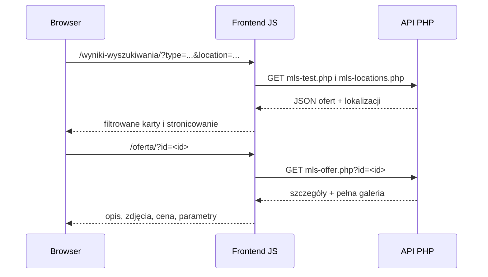
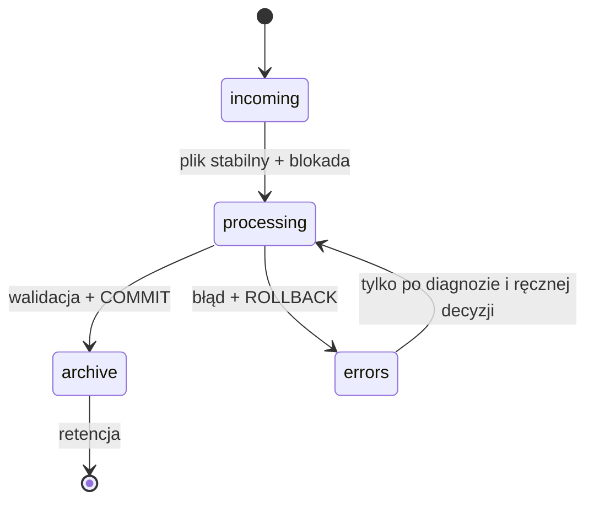
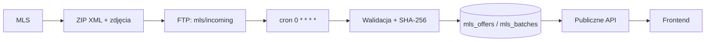

# MazurEstate — pełna dokumentacja techniczna

Prywatna kopia dokumentacji do przekazania i utrzymania serwisu. Zawiera stan audytu oraz rozdziały źródłowe; nie przechowuje haseł, tokenów ani kodów dostępu. Szczegółowe ustalenia oznaczono jako potwierdzone, wymagające weryfikacji albo planowane. Ten plik jest samodzielny — odniesienia do innych plików źródłowych opisano nazwami rozdziałów.

---

## Przegląd i indeks

## MazurEstate — dokumentacja techniczna

Stan audytu: **2 października 2026 r.** Punktem odniesienia dla kodu jest zdalny `azlkak/mazur`, `main` = `b365b4eca907fb4d8c593c76eb065cf1a3319664`. Ustalenia produkcyjne pochodzą z odczytowych operacji Hostinger Connector. Lokalna gałąź `main` ma dodatkowe, rozbieżne zmiany; nie jest dowodem stanu produkcji. Podczas audytu nie zmieniono produkcji, bazy, CRM, GitHuba ani harmonogramów.

### Jak czytać dokumentację

- **POTWIERDZONE — produkcja**: odczyt z Hostinger Connector 02.10.2026.
- **POTWIERDZONE — repo**: kod z podanego wyżej commita, niekoniecznie wdrożony na Hostingerze.
- **ZGODNE Z PRZESŁANKAMI**: wynika z DNS, `CNAME` i README, lecz bez bezpośredniego testu działającej strony.
- **UNKNOWN / TO VERIFY**: brak bezpiecznego, odczytowego dostępu albo dowodu. Nie interpretować jako „nie istnieje”.
- **PLANNED**: pomysł lub rekomendacja, nie funkcja produkcyjna.

### Executive technical overview

Statyczny, wielojęzyczny frontend jest utrzymywany w GitHubie. Domena główna ma rekordy wskazujące `azlkak.github.io`; repo zawiera `CNAME` i dokumentuje publikację z `main` przez GitHub Pages. Backend PHP i baza MySQL znajdują się na koncie Hostinger `u101822986`. Subdomena `api.mazurestate.pl` ma Hostingerowy document root `/home/u101822986/domains/mazurestate.pl/public_html`; publiczne pliki API są w `public_html/api/`. Prywatny importer i przechowywanie zdjęć mają być poza document root, w `domains/mazurestate.pl/mls/`; Connector nie pozwala odczytać tego katalogu, więc jego rzeczywistej zawartości nie zweryfikowano.

Produkcja ma dwa wpisy cron: MLS o pełnej godzinie i EstiCRM kwadrans po pełnej godzinie. To potwierdza **harmonogram**, nie skuteczność eksportu/importu. Ostatnie wyjście obu zadań dostępne przez Connector jest puste. Nie potwierdzono bieżącej zawartości tabel, ostatnich paczek, flagi w prywatnym `config.php` ani oferty `esti-215181`. Podobnie nie potwierdzono maksymalnego opóźnienia publikacji.

Publiczne API w repo ma listę ofert, szczegóły, zdjęcia, lokalizacje, oferty wyróżnione i formularz zapytań. Produkcyjny `public_html/api/` zawiera odpowiadające pliki, w tym formatter opisów; szczegóły ich działającego wdrożenia i zgodność bajtową z repo wymagają osobnego testu. Opis oferty pochodzi po polsku i może być zwracany jako `descriptionDocument` z bezpiecznym fallbackiem tekstowym. **Automatycznych tłumaczeń opisów nie wdrażamy na tym etapie**; interfejs PL/EN/UK/RU to odrębna funkcjonalność.

Najważniejsze otwarte ryzyko operacyjne: sama obecność crona EstiCRM nie dowodzi, że nowa paczka dochodzi, zostaje poprawnie zaimportowana i ma `publishable=1`. W pierwszej kolejności należy odczytowo sprawdzić ostatnie 48–72 godziny w `incoming/processing/archive/errors`, status importera i tabelę `mls_batches`, a następnie ścieżkę konkretnego ID od CRM do API.

**Aktualizacja 02.10.2026:** produkcyjny `public_html/api/enquiry.php` akceptuje już identyfikatory `esti-…` i wyszukuje ofertę po `(source, source_id)` — potwierdzono odczytem pliku na Hostingerze. Użytkownik potwierdził również, że formularz został przetestowany na produkcji. Wcześniejszy drift w tym miejscu został usunięty; nie wykonywano ponownego testu wysyłki podczas aktualizacji dokumentacji. Szczegóły są w API (rozdział: docs/backend-api.md).

### Indeks

| Obszar | Dokument |
| --- | --- |
| Mapa systemu i przepływ danych | Architektura (rozdział: docs/architecture.md) |
| Hosting, DNS, PHP, SSL | Infrastruktura (rozdział: docs/infrastructure.md) |
| Kod i proces GitHub | Repozytorium (rozdział: docs/repository.md) |
| Interfejs, wyszukiwanie, języki | Frontend (rozdział: docs/frontend.md) |
| Kontrakt HTTP | Backend API (rozdział: docs/backend-api.md) |
| Schemat i ograniczenia audytu DB | Baza danych (rozdział: docs/database.md) |
| Eksport MLS | Integracja MLS (rozdział: docs/mls-integration.md) |
| Eksport własnych ofert | Integracja EstiCRM (rozdział: docs/esticrm-integration.md) |
| Paczki ZIP i logika importu | Importer (rozdział: docs/importer.md) |
| Magazyn i galeria zdjęć | Zdjęcia (rozdział: docs/images.md) |
| Opisy ofert | Opisy (rozdział: docs/descriptions.md) |
| Późniejszy etap językowy | Tłumaczenia (rozdział: docs/translations.md) |
| Panel wyróżnień, ukrywanie i status | Panel admina (rozdział: docs/featured-admin.md) |
| Faktyczne harmonogramy | Cron jobs (rozdział: docs/cron-jobs.md) |
| Wdrożenie i rollback | Deployment (rozdział: docs/deployment.md) |
| Logi i obserwowalność | Monitoring (rozdział: docs/monitoring.md) |
| Przegląd ryzyk | Bezpieczeństwo (rozdział: docs/security.md) |
| Odtwarzanie danych | Backup i recovery (rozdział: docs/backup-recovery.md) |
| Diagnostyka incydentów | Runbook (rozdział: docs/operations-runbook.md) |
| Priorytety prac | Dług techniczny (rozdział: docs/technical-debt.md) |

### Granice audytu i wymagane potwierdzenia

Connector Hostinger odczytuje `public_html`, metadane hostingu, PHP, bazy, DNS i crony, ale nie prywatny katalog `mls/` ani rekordy SQL. Publiczna strona i API nie były dostępne z narzędzia przeglądania w czasie audytu; nie wykonano więc testu end-to-end, pomiaru opóźnienia EstiCRM ani wizualnej oceny desktop/mobile. Żaden wynik z README nie zastępuje tego potwierdzenia. Lista konkretnych odczytów uzupełniających znajduje się w runbooku (rozdział: docs/operations-runbook.md) i długu technicznym (rozdział: docs/technical-debt.md).

---

## docs/architecture.md

## Architektura i przepływ danych

**POTWIERDZONE — produkcja:** DNS `@` i `www` wskazuje `azlkak.github.io`; `api` wskazuje Hostinger CDN; Hostinger rozpoznaje główną domenę i subdomenę API w koncie `u101822986`. **ZGODNE Z PRZESŁANKAMI:** frontend publikuje GitHub Pages z `main`, jak opisuje repo. Bez udanego odczytu HTTP nie traktujemy całej ścieżki jako przetestowanej end-to-end.



Połączenia eksportowe i prywatne katalogi wynikają z kodu i konfiguracji opisanej w repo, lecz ich aktualny stan na serwerze jest **UNKNOWN / TO VERIFY**. Repo rozróżnia numery MLS i `esti-<id>` własnych ofert. W wynikach oferty własne są porządkowane przed MLS; deduplikacja używa `companyId:number`. Niezależna tabela może ukryć ofertę w portalu.

Przepływ interfejsu: parametry URL → JS danej strony → API JSON → render DOM. Wyszukiwarka filtruje i stronicuje pobraną listę w przeglądarce, nie w SQL. Szczegóły i pełna galeria są pobierane osobno.

---

## docs/backend-api.md

## Backend API — kontrakt i granice weryfikacji

Poniższy kontrakt wynika z `server/mls/public/api/` w `main@b365b4e`. Hostinger potwierdza istnienie odpowiadających plików w `public_html/api/`, ale nie przeprowadzono testu odpowiedzi HTTP wszystkich endpointów ani pełnego porównania produkcyjnej treści z repo. Źródłem danych jest prywatny `mls/config.php` i MySQL. API nie zwraca surowego `fields_json`.

| Metoda i ścieżka | Cel / parametry | Odpowiedź i ograniczenia |
| --- | --- | --- |
| `GET /api/mls-test.php` | Lista kandydatów `publishable=1`; bez parametrów | `{demo:false,count,offers:[…]}`; każde `images` ma najwyżej 5 URL, `imageCount` podaje liczbę wszystkich. Ukryte i zduplikowane `companyId:number` pomijane; błąd DB → 500. Brak uwierzytelnienia. |
| `GET /api/mls-offer.php?id=<id>` | Szczegół, MLS numeryczny lub `esti-<id>` | `{demo:false,offer:{…}}` z ceną, parametrami, pełną tablicą zdjęć, `description`, `descriptionDocument`, `descriptionLanguage:'pl'`; zły ID → 400, brak/ukryta → 404, błąd serwera → 500. Publiczny. |
| `GET /api/mls-image.php?name=<sha256>.jpg|png` | Obraz z prywatnego magazynu | JPEG/PNG, cache 7 dni; nieprawidłowa nazwa lub brak pliku → 404. Publiczny; nazwa jest ściśle walidowana. |
| `GET /api/mls-locations.php` | Dostępne miasto/dzielnica | `{count,locations:[{city,district}]}` z aktywnych, nieukrytych ofert; błąd → 500. Publiczny. |
| `GET /api/featured-offers.php` | Ręcznie wybrane aktywne ID MLS | JSON z listą ID; zależy od `featured_offers`, `mls_offers` i reguł widoczności. Publiczny. |
| `GET /api/featured-admin.php` | HTML panelu | Sesja/cookies; odpowiedź HTML. Akcje `?action=status` i `?action=integration-status` zwracają JSON; ta druga wymaga zalogowania. |
| `POST /api/featured-admin.php` | `request-code`, `verify-code`, `save`, `hide`, `restore`, `logout` | JSON; wymagania: dokładny Origin, JSON, dozwolony e-mail, OTP, następnie sesja i CSRF. Błędy 400/401/403/413/422/429/503 zależnie od akcji. |
| `POST /api/enquiry.php` | Formularz zapytania | JSON; imię, nazwisko, wiadomość, zgoda i telefon lub e-mail; limit, antyspam, sprawdzenie ID oferty; przekazuje do EstiCRM API. `OPTIONS` dla CORS. Błędy m.in. 403/405/422/429/5xx. |

**Aktualizacja produkcyjna — `enquiry.php`, 02.10.2026:** ponowny odczyt pliku na Hostingerze potwierdza limit `offer_id` 45 znaków, walidację `(?:esti-)?[0-9]{1,40}`, rozpoznanie źródła oraz zapytanie SQL po `(source, source_id)`. Wcześniej opisany drift został usunięty. Użytkownik potwierdził test formularza na produkcji; w ramach tej aktualizacji nie wykonano nowego zapytania testowego do CRM. Pozostałe wcześniej odczytane publiczne pliki API były semantycznie zgodne z repo (różnice końcowego newline/formatowania); prywatny importer nadal pozostaje nieporównany.

`portal-visibility.php` jest biblioteką pomocniczą, a `description-formatter.php` ma blokadę bezpośredniego wykonania; nie są endpointami biznesowymi. Pliki `featured-admin.html/css/js` są zasobami panelu. Reguły CORS w publicznych endpointach dopuszczają `https://mazurestate.pl`, `https://www.mazurestate.pl`, `https://azlkak.github.io`; CORS nie jest uwierzytelnianiem. Warto zweryfikować, czy publiczne URL i nazwy plików na Hostingerze są identyczne z repo po kolejnych ręcznych wdrożeniach.

Przykładowy, skrócony model szczegółów: `offer.id`, `offer.price`, `offer.area`, `offer.images[]`, `offer.descriptionDocument={schemaVersion:1,language:'pl',blocks:[…]}`. Nie włączamy prawdziwych rekordów klientów ani pełnych payloadów do dokumentacji.

---

## docs/backup-recovery.md

## Backup i disaster recovery

**POTWIERDZONE:** GitHub przechowuje kod frontendu oraz wersjonowane wzorce backendu; Connector pokazuje istnienie bazy i produkcyjnych plików API. W istniejącym `server/mls/README.md` są opisy historycznych ręcznych kopii przed migracją. **UNKNOWN / TO VERIFY:** aktywny harmonogram backupów Hostinger, retencja i test odtworzenia DB, kopia prywatnego `mls/`, magazynu zdjęć, eksportów ZIP, `config.php`, konfiguracji FTP i logów. Sam GitHub nie odtworzy bazy ani importowanych obrazów. Nie stwierdzono aktualnego RPO/RTO.

Plan odzyskania, **rekomendacja, nie wykonana operacja**:

1. Ustal moment ostatniej poprawnej paczki oraz zakres awarii: frontend, API, baza, obrazy, importer lub eksport zewnętrzny.
2. Zabezpiecz kopię aktualnego stanu i logów przed jakąkolwiek naprawą; nie usuwaj `errors/` ani `processing/` bez analizy.
3. Przywróć frontend z określonego commita GitHub. Backend odtwórz z ostatniej sprawdzonej kopii produkcyjnych plików, **nie** automatycznie z najnowszego repo.
4. Dla DB/obrazów przywracaj spójny zestaw z jednego punktu w czasie; weryfikuj `mls_batches`, `mls_offers`, `images_json` i pliki. Zabezpiecz prywatny `config.php` oddzielnie.
5. Dopiero po walidacji uruchom kontrolowany import paczek po punkcie odtworzenia; pełny ZIP wymaga potwierdzenia źródła i liczby rekordów.
6. Zrób smoke test listy, szczegółów MLS/EstiCRM, zdjęć, wyszukiwarki, formularza i panelu; zapisz datę odtworzenia.

Wdrożenie automatycznych backupów, replikacji i testów odzyskiwania jest **PLANNED** po uzgodnieniu pojemności, retencji i odpowiedzialności za dane.

---

## docs/cron-jobs.md

## Produkcyjne cron jobs

**POTWIERDZONE — produkcja przez Hostinger Connector, 02.10.2026:**

| Job | Schedule | Command | Źródło / cel | Spodziewany czas | Skutek awarii | Logi / wynik |
| --- | --- | --- | --- | --- | --- | --- |
| MLS (`7SEAMmQMRq`) | `0 * * * *` | `/usr/bin/php /home/u101822986/domains/mazurestate.pl/mls/bin/import.php` | Import MLS co godzinę | **UNKNOWN**; zależy od ZIP | Stare/nieaktualne oferty MLS | `logs/status-mls.json` według kodu repo; output z Connectora pusty |
| EstiCRM (`xa7iuLuoBw`) | `15 * * * *` | `/usr/bin/php /home/u101822986/domains/mazurestate.pl/mls/bin/import.php --source=esticrm` | Import własnych ofert co godzinę | **UNKNOWN** | Własne oferty nie pojawiają się lub nie znikają | `logs/status-esticrm.json` według kodu repo; output z Connectora pusty |

Strefa PHP ustawiona na `UTC`. Strefa samego harmonogramu hPanel/cron jest **UNKNOWN / TO VERIFY** — nie interpretować `0` i `15` jako czasu polskiego ani UTC bez potwierdzenia. Nie ma potwierdzonej częstotliwości eksportu po stronie MLS/EstiCRM; crony określają wyłącznie częstotliwość *sprawdzania* na Hostingerze. Puste ostatnie wyjście crona nie potwierdza sukcesu. Weryfikacja wymaga `status-*.json`, `mls_batches`, paczek i czasu modyfikacji plików. Niczego nie zmieniano w harmonogramach.

---

## docs/database.md

## Baza danych

**POTWIERDZONE — produkcja:** Hostinger pokazuje bazę `u101822986_mls` (MySQL, około 197 MB). Connector nie udostępnia odczytu SQL, zatem rzeczywiste `SHOW CREATE TABLE`, indeksy, liczby rekordów i zastosowane migracje są **UNKNOWN / TO VERIFY**. Poniższe tabele opisują schemat w repo `main@b365b4e`, nie bezwarunkowo produkcję.

| Tabela | Cel i źródło | PK / istotne indeksy | Ważne pola i relacje |
| --- | --- | --- | --- |
| `mls_offers` | Importowane rekordy MLS i EstiCRM | PK `(source,source_id)`; indeksy `publishable`, lokalizacji, `source_export_at` | `source_export_at`, `batch_sha256`, `publishable`, `fields_json`, `images_json`, `location_city`, `location_district`. `batch_sha256` logicznie odsyła do paczki, bez FK w schemacie. |
| `mls_batches` | Rejestr przetworzonych ZIP i deduplikacja SHA-256 | PK `(source,sha256)` | `file_name`, `export_type`, `imported_at`, `offer_count` |
| `portal_hidden_offers` | Ręczna blokada publikacji niezależna od eksportu | PK `(source,source_id)`, indeks `property_key` | `offer_number`, `title`, `hidden_at`; powiązanie logiczne z `mls_offers` |
| `featured_offers` | Do 10 ręcznie wybranych MLS na stronie głównej | PK `source_id`, UNIQUE `display_order` | `selected_at`; migracja osobna, nie jest w `schema.sql` |

Migracje repo: `20260928_offer_locations.sql`, `20260929_featured_offers.sql`, `20260929_mazowieckie_only.sql`, `20260929_offer_sources.sql`, `20260929_portal_hidden_offers.sql`. `schema.sql` służy do nowej instalacji, nie jest migratorem. Nie ma tabeli cache tłumaczeń ani kolejki tłumaczeń w obecnym schemacie repo. Nie ma tabeli lokalnych leadów — `enquiry.php` przekazuje dane do EstiCRM.

**DRIFT / TO VERIFY:** repo i istniejący backend mają ścieżki zgodności ze starym schematem bez kolumny `source`; bez `SHOW CREATE TABLE` nie można potwierdzić stanu produkcji. Dokument `server/mls/README.md` historycznie opisuje wykonanie migracji dwóch źródeł, lecz nie stanowi bieżącego odczytu tabel. Przed jakąkolwiek zmianą DB pobrać bezpieczny dump schematu (bez danych), porównać PK i indeksy z powyższą listą oraz wykonać backup. Nie publikować DSN ani danych uwierzytelniających.

---

## docs/deployment.md

## Deployment i wycofanie zmiany

### Frontend

Repo opisuje przepływ: zmiana w gałęzi → testy i przegląd PR → merge do `main` → GitHub Pages → `mazurestate.pl`. DNS i `CNAME` są zgodne z tym modelem; ustawienie publikacji Pages i żywy render nie zostały niezależnie sprawdzone. Zmiana CSS/HTML w `main` nie aktualizuje Hostinger PHP. `scripts/prepare-seo.py` generuje ścieżki językowe, sitemap i metadane; przy zmianach tras należy uruchomić `scripts/check-language-routes.py`. Workflow `.github/workflows/description-checks.yml` testuje wskazane pliki formattera/importera i JS, nie cały frontend.

### Backend

Na Hostingerze API jest w `public_html/api/`, a importer według konfiguracji crona w prywatnym `domains/mazurestate.pl/mls/bin/import.php`. Repo zawiera kod źródłowy, lecz nie wykryto potwierdzonego automatycznego pipeline'u, który synchronizuje PHP lub migracje po merge. Traktować deployment backendu jako **ręczny / TO VERIFY**, z oddzielnym porównaniem plików i backupem. Prywatny `config.php` i dane nie mogą trafić do repo ani artefaktu wdrożeniowego.



Procedura dla przyszłej zmiany backendu, **nie wykonywana w tym audycie**: (1) odczyt bieżącej wersji produkcyjnej i zgodności schematu; (2) backup wyłącznie dokładnych plików i bazy, jeśli zmiana dotyczy DB; (3) wdrożenie najmniejszej koniecznej różnicy; (4) `php -l` wdrożonych plików, test listy/szczegółu/zdjęcia/formularza oraz statusu importera; (5) w razie regresji przywrócenie plików i odpowiedni plan odzyskania DB. Nie nadpisywać ręcznie dostosowanego produkcyjnego `mls-offer.php` całym plikiem z repo bez diffu.

---

## docs/description-formatting.md

## Formatowanie opisów ofert — wdrożenie v1

### Zakres

Zaakceptowany wygląd: 16 px, interlinia 1.75, nagłówki, akapity, listy, pogrubienie i kursywa. Reguły nie dopisują opisów, zalet ani danych. Oryginał w `fields_json` pozostaje niezmieniony. Eksport zawiera tylko PL. Interfejs opisu EN/UK/RU wskazuje jawnie polski język źródła; NIE wdrożono automatycznego tłumaczenia ani żadnej płatnej usługi.

Frontend korzysta z `descriptionDocument` (schemaVersion 1, language pl, blocks), a przy starym API albo nieprawidłowych blokach używa istniejącego `description`. Wybrane samodzielne etykiety PL i co najmniej dwa kolejne zgodne punktory tworzą nagłówki/listy. Kwoty, jednostki, negacje, dodatkowe koszty i zastrzeżenia nie są przepisywane.

### GitHub Pages

Publikacja `main` dostarcza `oferta/script.js`, `assets/js/offer-description.mjs` i `assets/css/offer-description.css`. Nie aktualizuje PHP na Hostingerze. Nie zmieniono galerii, parametrów, formularza ani tłumaczeń pozostałych części strony. Moduł nie blokuje wczytania oferty: do czasu jego załadowania dostępny jest zwykły opis. Po publikacji może być potrzebne odświeżenie z pominięciem pamięci podręcznej.

### Hostinger — minimalna zmiana istniejącego API

Nie nadpisywać całego produkcyjnego `mls-offer.php` kopią z repozytorium: inne funkcje mogą być wdrożone niezależnie. Nie ruszać `mls-test.php`, `config.php`, importera, bazy ani zdjęć.

Najpierw zapisać kopię obecnego `public_html/api/mls-offer.php` poza publicznym katalogiem. Sprawdzić, że PHP ma ext-dom (bez niego opis HTML bezpiecznie wróci do zwykłego tekstu).

1. Wgrać nowy `server/mls/public/api/description-formatter.php` jako `public_html/api/description-formatter.php`. Nie nadpisuje istniejących plików. Wejście na sam adres tego helpera ma celowo zwrócić 404.

2. W `mls-offer.php`, po `declare(strict_types=1);` i obok istniejącego `require_once`, dodać:

```php
if (is_file(__DIR__ . '/description-formatter.php')) require_once __DIR__ . '/description-formatter.php';
```

W tablicy `$offer` pozostawić istniejące pole `description`, a bezpośrednio po nim dodać:

```php
'descriptionDocument' => function_exists('mazurDescriptionDocument')
    ? mazurDescriptionDocument(firstText($fields, 'descriptionWebsite', 'description')) : null,
'descriptionLanguage' => 'pl',
```

3. Zastąpić wyłącznie dotychczasową funkcję `publicDescription()` poniższą wersją. Zachowuje granice bloków także dla starszego klienta i naprawia zamianę twardych spacji na nowe linie:

```php
function publicDescription(string $value): string
{
    $value = preg_replace('~<(?:br|hr)\b[^>]*>|</(?:p|div|h[1-6]|li|ul|ol|section|article|blockquote|tr|td|th)\s*>~i', "\n", $value) ?? $value;
    $value = html_entity_decode(strip_tags($value), ENT_QUOTES | ENT_HTML5, 'UTF-8');
    $value = str_replace(["\r\n", "\r", "\u{00A0}", "\u{202F}"], ["\n", "\n", ' ', ' '], $value);
    $value = preg_replace('/[ \t]+/u', ' ', $value) ?? $value;
    $value = preg_replace('/\n{3,}/u', "\n\n", $value) ?? $value;
    return trim($value);
}
```

Kontrola składni przed publikacją: `php -l public_html/api/mls-offer.php` oraz `php -l public_html/api/description-formatter.php` (ścieżki zależą od bieżącego katalogu SSH). Nie udostępniać endpointu do uruchamiania poleceń PHP.

### Sprawdzenie po aktywacji

Na istniejącej aktywnej ofercie sprawdzić HTTP 200, tekst, pełną galerię i formularz. API szczegółów powinno zawierać `offer.descriptionDocument.schemaVersion: 1`, `language: pl` i bloki. `null` oznacza użycie bezpiecznego fallbacku, np. brak ext-dom, przekroczone limity lub nieprawidłowy format.

Sprawdzić co najmniej kilka rzeczywistych opisów HTML/tekstowych, oferty z opłatami i negacjami, PL/EN/UK/RU oraz ekran mobilny. Usuniętych wcześniej granic HTML nie da się pewnie odtworzyć ze starego `description`; pełny efekt wymaga odczytu surowego opisu przez nowy helper. Obecna zmiana formatuje opis przy odczycie API, bez zmiany importera i bez ponownego importu zdjęć. Cache/tłumaczenia po imporcie to osobny etap.

### Bezpieczeństwo i ograniczenia

Helper parsuje opis jako dane, nigdy nie zwraca HTML do wstawienia przez innerHTML. DOMDocument służy jedynie do ekstrakcji tekstu i dozwolonych typów bloków, nie do sanitizacji/serializacji HTML. Atrybuty źródłowe, skrypty i nietekstowe zasoby są odrzucane; odnośniki pozostają tekstem. Tabele są spłaszczane kolejno. Renderer tworzy nowe elementy i węzły tekstowe. Limity rozmiaru/głębokości i błędy mają prowadzić do fallbacku, nie do niedostępności całej oferty.

Nie jest to audyt wszystkich danych produkcyjnych. Testy wykorzystują dane syntetyczne. Nie przenoszą kolorów/fontów z CRM ani formatowania zapisanego wyłącznie w CSS. Nie uruchomiono usług tłumaczenia.

### Testy i wycofanie

`php scripts/test-description-formatter.php --require-dom` sprawdza parser, zachowanie treści i przypadki bezpieczeństwa. `node --test scripts/test-offer-description.mjs` sprawdza strukturę, stary API i fallback. Workflow `Description formatter checks` sprawdza także składnię API i skryptu strony.

W przypadku problemu przywrócić lokalną kopię `mls-offer.php`. Nowy frontend działa także ze starym API. Nie kasować oryginalnych opisów, obrazów ani bazy. W razie potrzeby wycofać commit frontendu przez zwykły revert, nie force push.

---

## docs/descriptions.md

## Opisy ofert

Kod repo: `descriptionWebsite` (fallback `description`) → `description-formatter.php` → `descriptionDocument` (`schemaVersion=1`, `language='pl'`, `blocks`) → `assets/js/offer-description.mjs`. `mls-offer.php` nadal zwraca zwykłe `description` po usunięciu HTML, aby starszy frontend i awarie formattera nie blokowały oferty. Hostinger potwierdził obecność produkcyjnych plików `description-formatter.php` oraz `mls-offer.php`; odczyt początku produkcyjnego `mls-offer.php` potwierdził warunkowe dołączenie formattera i funkcję tekstowego fallbacku. Pełnego działania dla świeżej oferty nie zweryfikowano w tym audycie.

Formatter rozpoznaje akapity, nagłówki i listy, zachowuje dozwolone oznaczenia `strong` i `em`, ma limity złożoności oraz wyklucza wykonywalne HTML. Frontend waliduje strukturę bloków i buduje elementy DOM zamiast wstrzykiwać surowe HTML; w razie nieprawidłowego dokumentu zostawia zwykły tekst. Heurystyka list wymaga co najmniej dwóch kolejnych zgodnych punktów; samotny myślnik nie jest zgadywany jako lista. Etykiety sekcji są polskie i dotyczą układu, lokalu, kosztów itp.; nie ma gwarancji, że każdy nietypowy eksport otrzyma idealną strukturę.

Wersjonowanie plików frontendowych odbywa się przez query przy URL modułu i CSS; zmiana kodu bez zmiany wersji może zatrzymać stary asset w cache. Przed wydaniem testować opis z akapitami, listami, nagłówkami, pogrubieniem, kursywą i czystym tekstem oraz zgodność zwykłego `description`. Opisy **nie są tłumaczone** — zobacz osobny, późniejszy etap (rozdział: translations.md).

---

## docs/esticrm-integration.md

## Integracja EstiCRM — własne oferty

W modelu opisanym w repo ofertę kwalifikuje status „Aktywna publikacja” i wybór portalu MazurEstate w polu `EX`. Osobny eksport EstiCRM XML ma trafiać do prywatnego `mls/esticrm/incoming/`; nie miesza się z paczkami MLS. Cron `15 * * * *` z `--source=esticrm` jest **POTWIERDZONY — produkcja** 02.10.2026. Użytkownik potwierdził politykę publikacji ofert własnych **z całej Polski**; ograniczenie wojewódzkie ma dotyczyć tylko MLS. Kod zdalnego `main` tę regułę odzwierciedla, lecz wersja prywatnego importera na Hostingerze jest **UNKNOWN / TO VERIFY**.



Repo importer: aktywacja zależy od prywatnego `esticrm_import_enabled`; rekord wymaga `status='3'`, a filtr `offerExport='1'` jest stosowany tylko do MLS. Własny ID API ma postać `esti-<numer>`. Import pełny usuwa nieobecne rekordy **tylko własnego źródła**. Frontend i API mogą ukrywać duplikat po `companyId:number`; ręczne ukrycie zachowuje się niezależnie od kolejnych importów.

**UNKNOWN / TO VERIFY:** faktyczna wartość flagi, uruchomiona wersja importera, katalogi i paczki EstiCRM, znaczenie `EX` w obecnej konfiguracji eksportu, częstotliwość generowania/wysyłania paczek, ostatnie 48–72 h timestampów, wynik ostatniego importu, liczba rekordów `publishable=1`, czas maksymalny od EX do publikacji, obecność konkretnej oferty `215181`. Puste wyjście crona w Connectorze nie jest sukcesem. Nie zgadywać opóźnienia na podstawie samego `:15`. Minimalna diagnostyka jest w runbooku (rozdział: operations-runbook.md).

**Formularz zapytań — poprawione 02.10.2026:** produkcyjne `enquiry.php` przyjmuje `offer_id=esti-…` i odczytuje ofertę po `(source, source_id)`, co potwierdzono przez ponowny odczyt pliku. Użytkownik potwierdził test formularza na produkcji. Nie jest to dowód, że importer EstiCRM i wszystkie własne oferty są aktualne — te etapy nadal wymagają osobnej weryfikacji.

---

## docs/featured-admin.md

## Panel wybranych i widoczności ofert

Kod repo udostępnia panel pod `https://api.mazurestate.pl/api/featured-admin.php`; produkcyjne pliki panelu i API są obecne w `public_html/api/`. Logowanie: lista dozwolonych e-maili z prywatnego `config.php`, jednorazowy 6-cyfrowy kod e-mail ważny 10 minut, do 5 prób w sesji, ograniczenie żądań według IP/e-mail, regeneracja sesji, cookie `Secure`, `HttpOnly`, `SameSite=Strict`, token CSRF dla akcji zmieniających stan. Wartości dozwolonych adresów i kody nie należą do dokumentacji.

`featured_offers` przechowuje maksymalnie 10 wybranych ofert i kolejność. Obecny kod zapisu przyjmuje **tylko numery MLS**, mimo że panel ukrywania/przywracania obsługuje również `esti-<id>`. `portal_hidden_offers` jest niezależne od importera; ukrycie działa w liście, lokalizacjach, wyróżnieniach i szczegółach. Ukrycie duplikatu przez `companyId:number` obejmuje oba źródła. Po zalogowaniu `integration-status` ma pokazywać stan MLS i EstiCRM, ostatnie paczki i telemetrię, lecz jego rzeczywiste dane nie zostały odczytane bez logowania.

**UNKNOWN / TO VERIFY:** poprawność wysyłki OTP na produkcji, faktyczna zawartość tabel, lista administratorów, aktualny stan panelu po logowaniu. Test nie powinien utrwalać ani ujawniać kodów OTP. Zmiana listy uprawnionych adresów wymaga bezpiecznej operacji na prywatnym `config.php` poza tym audytem.

---

## docs/frontend.md

## Frontend

Źródło: statyczne HTML/CSS/JS w repo `main@b365b4e`. Strona główna, kategorie `domy/`, `dzialki/`, `lokale-komercyjne/`, hub `doradztwo/`, landingi specjalistyczne, `wyniki-wyszukiwania/` i `oferta/` używają współdzielonego `assets/`. Nawigacja i stopka są częściowo budowane przez `site-chrome.js`. Widoki EN/UK/RU mają osobne ścieżki, a stare `?lang=` są obsługiwane skryptem tras; interfejs nie jest tym samym co tłumaczenie treści ofert.



Wyniki filtrują w przeglądarce według typu, transakcji, lokalizacji, ceny, powierzchni, liczby pokoi, piętra, zdjęć i innych pól; parametry URL są stanem wyszukiwarki. API listy przesyła wszystkie publikowalne oferty i po 5 zdjęć podglądowych, co jest ograniczeniem skalowalności. Karta szczegółów osobno pobiera pełną galerię, aktualizuje metadane i przekazuje ID do formularza kontaktowego. Gdy nowe renderowanie opisu zawiedzie, zostaje widok tekstowy. `featured-offers.js` pobiera ID wyróżnień i dociąga szczegóły; sekcja może być ukryta przy błędzie.

Baner `cookie-consent.js` zapisuje wybór w `localStorage`. Kod strony głównej zawiera identyfikator GA4 i ustawia `analytics_storage` na `denied` bez zgody; zgoda aktualizuje Consent Mode. Obecność kodu w repo nie dowodzi poprawnych zdarzeń w żywym GA4. Nie stwierdzono aktywnego Meta Pixel w tym przeglądzie. Responsywność jest implementowana CSS, lecz wizualny test produkcji na telefonie i tablecie był niedostępny — **UNKNOWN / TO VERIFY**.

Uwaga jakościowa: w `oferta/script.js` część etykiet, tytułów i tekstów błędów jest wpisana po polsku mimo parametru języka. Renderer opisu informuje po EN/UK/RU, że źródłowy opis jest PL. Audyt pełnej jakości lokalizacji dynamicznej strony ofert wymaga osobnego testu; nie należy przedstawiać opisów ofert jako przetłumaczonych.

---

## docs/images.md

## Zdjęcia ofert

Kod repo realizuje ścieżkę: ZIP MLS/EstiCRM → walidacja typu, CRC, rozmiaru i wymiarów → prywatne `mls/images/<sha256>.jpg|png` → `images_json` w `mls_offers` → `mls-image.php?name=…` → przeglądarka. Importer współdzieli magazyn pomiędzy źródłami i usuwa osierocone pliki po pełnym imporcie, uwzględniając wszystkie oferty. **UNKNOWN / TO VERIFY:** faktyczna zawartość prywatnego magazynu i produkcyjna wersja importera.

`mls-test.php` w repo zwraca do wyników najwyżej 5 URL miniatur na ofertę i oddzielny `imageCount`; nie pobiera całej galerii w odpowiedzi listy. `mls-offer.php` zwraca pełną tablicę URL, a widok oferty otwiera galerię i lightbox. Moduł `results-gallery.mjs` obsługuje galerię karty wyników. `mls-image.php` zezwala tylko na nazwę z 64 znaków hex i rozszerzeniem jpg/png, nie śledzi symlinków i ustawia `Cache-Control: public, max-age=604800, immutable`. Jeśli plik nie istnieje, zwraca 404.

Diagnoza brakującego zdjęcia: porównaj `imageCount`, liczbę URL w szczegółach i wartości `images_json`; sprawdź istnienie hashowanego pliku, wynik endpointu obrazu, a na końcu render i ewentualny cache przeglądarki. Nie kasować galerii ani nie uruchamiać ponownie pełnego importu jako pierwszego kroku.

---

## docs/importer.md

## Importer ZIP — zachowanie kodu repo

Źródło: `server/mls/private/bin/import.php` z `main@b365b4e`. Faktycznie wdrożona wersja prywatna jest **UNKNOWN / TO VERIFY**. CLI: bez argumentów źródło MLS; `--source=esticrm` wybiera drugi katalog; `--check /absolute/package.zip` waliduje pojedynczy ZIP bez importu. Konfigurację pobiera z prywatnego `mls/config.php`; wzór w repo nie zawiera sekretów. Wymaga rozszerzeń `zip`, `SimpleXML`, `pdo_mysql`.

1. Weryfikuje włączenie odpowiedniego źródła oraz katalogi `incoming/processing/archive/errors`. Bierze `flock` na wspólnym zamku. Jeśli w `errors/` jest ZIP, przerywa, zamiast pomijać błąd.
2. Sortuje pliki po znaczniku daty z nazwy, czeka co najmniej `min_age_seconds` (w przykładzie 600 s), przenosi paczkę do `processing/`.
3. Odrzuca symlink, niewłaściwą strukturę ZIP, duplikaty nazw, niezgodne CRC, przekroczone limity, wadliwe XML/obrazy, niedozwolone akcje i nieoczekiwanie pusty pełny eksport. Liczy SHA-256 całej paczki i rekordów; pomija ponowny import tego samego `(source,sha256)`.
4. Zapisuje obrazy pod nazwą hasha. W transakcji DB stosuje `create/update/delete`; nie nadpisuje rekordu starszym `source_export_at`. Pełny eksport jest snapshotem danego źródła i usuwa rekordy, których w nim nie ma. `publishable` wymaga aktywnego statusu; dla MLS także `offerExport=1` i Mazowieckiego, dla EstiCRM brak filtra regionu w kodzie repo.
5. Po `COMMIT` przenosi ZIP do `archive/<sha>.zip`, raportuje pominięcia i usuwa archiwalne paczki po retencji. Pełny eksport może usuwać nieużywane obrazy po porównaniu z całą tabelą.
6. Błąd przed commitem wycofuje transakcję i przenosi ZIP do `errors/`; ponowne przetworzenie wymaga świadomej analizy. Status biegu trafia do `logs/status-<source>.json`, a przypadki pominięcia do `logs/skipped-<sha>.json`; błędy DB są maskowane w komunikacie.



Istotna granica: paczka pełna błędnie uznana za poprawną może usunąć oferty danego źródła. Kod ma minimalną liczbę rekordów, ale nie potwierdzono progu faktycznie skonfigurowanego na produkcji. Dlatego przed wznowieniem po błędzie trzeba obejrzeć rodzaj eksportu i liczebność, nie tylko samą składnię XML.

---

## docs/infrastructure.md

## Infrastruktura

Stan Hostinger Connector 02.10.2026:

| Element | Potwierdzony stan |
| --- | --- |
| Konto hostingowe | `u101822986` |
| Główna domena | `mazurestate.pl`, `vhost_type=main`, `website_type=other` |
| API | `api.mazurestate.pl`, `vhost_type=subdomain`, `website_type=other` |
| Document root widoczny w Hostinger | `/home/u101822986/domains/mazurestate.pl/public_html` dla obu wpisów |
| Publiczne pliki backendu | `public_html/api/` — 13 plików; szczegóły w API (rozdział: backend-api.md) |
| Prywatne pliki | oczekiwana ścieżka `domains/mazurestate.pl/mls/`; **UNKNOWN / TO VERIFY** (poza zakresem przeglądarki plików Connectora) |
| Baza | `u101822986_mls`, MySQL, około 197 MB zgłoszonego użycia, limit 3072 MB; zawartość tabel nieodczytana |
| PHP | 8.3.33; `zip`, DOM, `nd_pdo_mysql`, GD i Imagick dostępne; strefa PHP `UTC` |
| SSL na wpisach Hostinger | status `active`, przekierowanie HTTPS włączone; dotyczy konfiguracji Hostinger, nie potwierdza certyfikatu faktycznie serwowanego przez GitHub Pages |

DNS w strefie Hostinger: `@` (ALIAS) i `www` (CNAME) → `azlkak.github.io`; `api` (ALIAS) → `api.mazurestate.pl.cdn.hstgr.net`; `ftp` (A) → serwer Hostinger. Rekordy pocztowe Hostinger są obecne. Nie zapisujemy tutaj adresów właścicieli, haseł FTP ani tokenów. Bez bezpośredniego testu HTTP status i issuer certyfikatu użytkownika końcowego są **UNKNOWN / TO VERIFY**.

Produkcja ma dwa crony, opisane w harmonogramach (rozdział: cron-jobs.md). `log_errors` w panelu PHP ma wartość `Off`; możliwe niezależne logi aplikacji i hostingu wymagają potwierdzenia. Mechanizm kopii DB i filesystemu, retencja, monitoring zasobów, faktyczna pojemność konta i wersja CLI PHP są **UNKNOWN / TO VERIFY**. Widoczne `public_html/default.php` i `default.php.old.php` nie są frontendem GitHub Pages.

---

## docs/mls-integration.md

## Integracja MLS

Model w repo: MLS przygotowuje pełne lub przyrostowe ZIP EstiCRM XML; oddzielne konto FTP dostarcza je do prywatnego `mls/incoming/`. Godzinny cron importera uruchamia się o `0 * * * *` — **potwierdzone na produkcji**. Kod `import.php` w repo przyjmuje domyślne `--source=mls`, weryfikuje paczkę, zapisuje zdjęcia i w transakcji aktualizuje `mls_offers` oraz `mls_batches`. Publiczne API ogranicza dane do `publishable=1`; obecny kod repo utrzymuje filtr woj. mazowieckiego tylko dla MLS.



Nie potwierdzono dziś konta FTP, najnowszego timestampu paczki, stanu katalogów ani świeżości API. `server/mls/README.md` zawiera starszy opis pierwszych importów oraz wcześniejszego problemu z odbiorem MLS; traktować jako historię, nie automatycznie jako stan aktualny. Dostawca może wysyłać aktualizacje częściej lub rzadziej niż działa cron — czasu od zmiany w MLS do publikacji nie da się wyliczyć bez odczytu bieżących paczek i eksportowego harmonogramu. Dla awarii korzystaj z runbooka (rozdział: operations-runbook.md).

---

## docs/monitoring.md

## Logowanie i monitoring

W kodzie repo importer zapisuje `logs/status-mls.json` i `logs/status-esticrm.json` przy rozpoczęciu, sukcesie i błędzie; raport pominięć to `logs/skipped-<sha>.json`. Panel `featured-admin.php?action=integration-status` po uwierzytelnieniu czyta status i historię paczek, rozróżniając źródła. Progi ostrzeżenia w panelu po 2 h 15 min bez potwierdzenia są opisane w istniejącym README; aktualne działanie panelu po logowaniu jest **UNKNOWN / TO VERIFY**.

Connector zwrócił dwa crony z pustym „last output”. Nie potwierdza to ich sukcesu. `log_errors=Off` w konfiguracji PHP Hostinger; niezależne logi WWW/CLI mogą istnieć, ale ich ścieżka i retencja są **UNKNOWN / TO VERIFY**. Lokalna lista plików `public_html` nie obejmuje prywatnych `logs/` ani `errors/`. Nie ma potwierdzonego zewnętrznego alertingu lub metryk importera.

Codzienna kontrola read-only: odczytaj status obu źródeł po zalogowaniu, ostatni czas importu w `mls_batches`, liczby `publishable`, ostatnie paczki w `incoming/processing/archive/errors`, a następnie wynik API listy i szczegółu. Alarm: brak nowego przebiegu ponad jeden pełny cykl plus bufor, rosnący `errors/`, brak paczek mimo potwierdzonego eksportu, spadek liczby publikowanych rekordów lub HTTP 5xx. Konkretne progi i właściciel alertu są **PLANNED**. W przypadku oferty `esti-215181` przejść runbook (rozdział: operations-runbook.md), nie uruchamiać ponownie pełnego importu bez analizy.

---

## docs/operations-runbook.md

## Operations runbook — diagnoza bez zgadywania

Stan wiedzy na 02.10.2026. Wszystkie poniższe kontrole mają być **odczytowe**; wymagają właściwego, autoryzowanego dostępu do prywatnego hostingu, panelu lub bazy. Nie zapisuj haseł, kodów OTP, pełnych rekordów klientów ani pełnych XML do zgłoszenia. Jeżeli nie ma dostępu, zanotuj **UNKNOWN / TO VERIFY** i poproś operatora o wynik kontroli — nie zastępuj go domysłem.

### Oferta EstiCRM nie pojawia się (np. wewnętrzne ID 215181)

| Etap | Co potwierdzić | Jeśli nie przechodzi |
| --- | --- | --- |
| CRM | Czy status kwalifikuje do publikacji i portal MazurEstate jest zaznaczony w `EX` | Poprawić dopiero za zgodą operatora CRM; zanotować czas zmiany. |
| Eksport | Czy po zmianie powstał ZIP; jaki ma timestamp, tryb `full/incremental` i czy zawiera ID | Ustalić konfigurację i częstotliwość EstiCRM; nie zakładać, że cron serwera tworzy eksport. |
| Transport FTP | Czy ZIP dotarł do `mls/esticrm/incoming/`, kiedy i pod jaką nazwą | Sprawdzić log dostarczenia i uprawnienia konta, bez publikowania hasła. |
| Kolejka plików | Czy paczka jest w `incoming/`, `processing/`, `archive/` czy `errors/` | `errors/` blokuje kolejne przebiegi według kodu repo. Nie kasować pliku; odczytać przyczynę. |
| Cron i status | W hPanel: `15 * * * * --source=esticrm`; w prywatnym `logs/status-esticrm.json` ostatnie `run/success/error` | Sam wpis cron i pusty output nie są sukcesem; sprawdzić właściwy CLI PHP i wersję importera. |
| Baza | Czy `mls_batches` ma SHA paczki i czy `mls_offers` ma `(source='esticrm',source_id='215181')`, `publishable`, `source_export_at` | Jeśli brak: walidacja/import. Jeśli `publishable=0`: sprawdzić `status`, flagę w prywatnej konfiguracji i **faktycznie wdrożony** filtr regionu. |
| Widoczność portalu | Czy nie ma wpisu w `portal_hidden_offers` lub duplikatu `companyId:number` z wyższym priorytetem | Nie zmieniać ukrycia bez decyzji administratora. |
| API | Czy lista i `mls-offer.php?id=esti-215181` zwracają rekord i właściwe dane | 404 po obecności w DB wskazuje na filtr widoczności, źródło, schema drift lub inną wersję API. |
| Frontend | Czy poprawny URL zawiera `id=esti-215181`, dane dochodzą, a przeglądarka nie ma błędu JS | Dopiero teraz diagnozować cache/routing/CORS. |

Jeżeli karta własnej oferty działa, ale formularz zwraca `422 invalid_offer`, sprawdź rzeczywisty `offer_id` w żądaniu oraz bieżącą walidację `enquiry.php`. Poprawka przyjmująca `esti-…` jest obecna na produkcji od 02.10.2026, a użytkownik potwierdził jej test. Nie zakładaj automatycznie, że taki błąd oznacza problem z importerem lub ustawieniem EX w CRM.

Nieznana jest częstotliwość eksportu z CRM, więc nie wolno obiecywać czasu publikacji na podstawie samego godzinnego crona. Zbierz timestampy eksportu, odbioru i importu z ostatnich 48–72 h i dopiero wtedy podaj obserwowany lag. Import pełny może usuwać oferty danego źródła; **nie uruchamiać go ponownie jako testu**.

### Oferta MLS nie pojawia się

Idź tą samą ścieżką: uprawnienie do eksportu MLS → data i zawartość ZIP → `mls/incoming/` → cron o pełnej godzinie → `processing/archive/errors` → `status-mls.json` i `mls_batches` → `mls_offers.publishable` → ręczne ukrycie/duplikat → API → UI. W kodzie repo MLS wymaga statusu `3`, `offerExport=1` i woj. mazowieckiego. Te reguły trzeba sprawdzić na wdrożonej wersji importera, nie wyłącznie w repo. Jeśli nie dochodzą nowe paczki, problem jest przed importerem.

### Zdjęcia nie działają lub brakuje części

Porównaj `images_json` z `offer.images` i `imageCount`; sprawdź pojedynczy URL `mls-image.php?name=<hash>.jpg|png`, istnienie prywatnego pliku, jego rozmiar/MIME i odpowiedź 200/404. Jeśli lista pokazuje tylko pięć URL, to zamierzony podgląd — szczegół ma pełną galerię. Jeśli szczegół także jest niepełny, szukaj braku w ZIP lub błędu importu. Dopiero po ustaleniu źródła problemu rozważ cache (obrazy są cache'owane do 7 dni).

### Opis formatuje się źle

Sprawdź kolejno surowy tekst źródła `descriptionWebsite`/`description`, odpowiedź API `descriptionDocument` (`schemaVersion=1`, `language=pl`, `blocks`), obecność produkcyjnego formattera, konsolę JS i wersję assetu `offer-description.mjs`. Jeśli dokument jest `null`, zwykły `description` ma nadal działać. Nie modyfikuj opisów MLS ani nie „naprawiaj” ich tłumaczeniem; przygotuj anonimową próbkę i test regresji.

### API zwraca 500

Zanotuj endpoint, czas, status i niejawny identyfikator korelacyjny. Sprawdź najpierw, czy problem dotyczy wszystkich endpointów czy jednego; potem ostatnią zmianę plików, dostęp DB, poprawność `config.php` bez ujawniania wartości, PHP/rozszerzenia, zgodność schematu i log aplikacji/hostingu. Nie wysyłaj w odpowiedzi surowego wyjątku PDO. Jeśli 500 rozpoczął się po wdrożeniu, użyj kopii dokładnie zmienionych plików zgodnie z deploymentem (rozdział: deployment.md).

### Search nie pokazuje oferty

Rozdziel brak w API od filtrowania po stronie klienta. Jeśli szczegół 200, ale lista nie zawiera ID, sprawdź `publishable`, `portal_hidden_offers`, regułę deduplikacji `companyId:number` i typ transakcji. Jeśli lista zawiera ID, sprawdź URL query, typ, miasto, cenę, powierzchnię, piętro, `photos` i reset filtrów. Nie zakładaj, że wynik jest paginowany przez serwer.

### Panel admina nie wysyła OTP

Bez pobierania prawdziwego kodu sprawdź dozwolony adres w prywatnym `config.php`, limiter IP/e-mail, odpowiedź `request-code`, działanie `mail()`/serwera poczty, folder spam i logi bez danych wrażliwych. Panel celowo nie powinien ujawniać, czy adres jest na liście. Nie wyłączaj limitera ani nie dodawaj adresu bez autoryzacji.

### Frontend po deployu nie wygląda na zaktualizowany

Ustal commit, który jest na `main`, wynik workflow/Pages i ścieżkę `CNAME`; sprawdź URL kanoniczny, cache przeglądarki i wersjonowanie CSS/JS. GitHub Pages nie aktualizuje PHP na Hostingerze. Zmiany logo/paddingów mogą pojawić się niezależnie od prac backendowych.

### Importer przestał działać

Sprawdź oba wpisy crona, status każdego źródła, `errors/`, wolne miejsce, wiek paczki, globalny lock, limity ZIP, wersję CLI PHP i rozszerzenia, dostęp do DB. Nie przenoś paczek z `errors/` na ślepo. Dla trybu `full` najpierw ustal oczekiwaną liczbę ofert i wykonaj backup. Jeśli producent nie wysyła ZIP, naprawa crona nie wystarczy.

### Minimalny zestaw danych do zgłoszenia

Źródło (`mls`/`esticrm`), publiczny identyfikator oferty, czas ostatniej zmiany w CRM/MLS, czas najnowszego eksportu/odbioru/importu, nazwa paczki bez zawartości, ostatni wynik statusu, liczba `publishable`, odpowiedzi HTTP listy/szczegółu, commit frontendu i identyfikator wersji produkcyjnego importera. Nie dołączać haseł, tokenów ani pełnych opisów klientów.

---

## docs/repository.md

## Repozytorium i wersjonowanie

Zdalny `azlkak/mazur` ma domyślną gałąź `main`; podczas audytu `main@b365b4e`. Lokalne `main@3b3a840` jest rozbieżne z origin (`ahead 1, behind 4`), więc lokalna zawartość nie służy jako dowód wdrożenia. Nie wykonywano fetch/merge/commit/PR. Równoległe zmiany wyglądu są poza zakresem dokumentacji.

Frontend nie wymaga buildu: strony `index.html` w katalogach usług i kategorii, współdzielone `assets/css`, `assets/js`, `assets/images`; wersje `/en/`, `/uk/`, `/ru/` generowane przez `scripts/prepare-seo.py`. `robots.txt`, `sitemap.xml` i `CNAME` są w repo. `server/mls/private/` zawiera wzór konfiguracji, schemat, migracje i importer; `server/mls/public/api/` zawiera wersjonowane pliki API. Prywatny produkcyjny `config.php`, paczki i obrazy nie należą do repo.

Skrypty kontrolne w `scripts/`: test formattera PHP, test renderowania JS, test regionów importera, kontrola tras językowych i generator SEO. Workflow `.github/workflows/description-checks.yml` uruchamia PHP lint/testy i test JS przy zmianach wskazanych plików; **nie** jest automatycznym wdrożeniem backendu. `docs/description-formatting.md` i `docs/seo-plan.md` to wcześniejsza dokumentacja tematyczna. Testy nie obejmują pełnego systemu, integracji z żywą bazą ani przebiegów FTP.

Frontendowy proces publikacji opisuje repo: zmiana → test → PR → `main` → GitHub Pages. Faktyczne ustawienie GitHub Pages i historia wdrożeń nie zostały odczytane przez Connector, więc etap ten jest **ZGODNY Z PRZESŁANKAMI**, nie niezależnie potwierdzony. Backend Hostinger ma osobne, ręczne wdrożenie; push do `main` nie zmienia plików PHP na serwerze.

---

## docs/security.md

## Lekki przegląd bezpieczeństwa

Audyt jest pasywny — bez pentestu. Oceny dotyczą tylko dowodów z repo i metadanych Hostinger, nie są certyfikatem bezpieczeństwa.

| Poziom | Ustalenie | Dowód i skutek | Rekomendacja |
| --- | --- | --- | --- |
| **Medium** | Brak potwierdzonego monitoringu i retencji logów | Puste last-output cron; PHP `log_errors=Off`; prywatne logi nieodczytane. Awarie importu mogą pozostać niezauważone. | Potwierdzić statusy, logi, alerty i właściciela reakcji. |
| **Medium** | Ręczny backend deploy bez udokumentowanego automatycznego porównania | Repo deklaruje oddzielny deploy Hostinger, pliki produkcyjne nie są w pełni porównane. Ryzyko driftu. | Lista kontrolna diff/backup/lint/smoke/rollback. |
| **Low / TO VERIFY** | Ustawienia sesji PHP domyślnie mają `cookie_secure=Off`, `httponly=Off`, `strict_mode=Off` | Odczyt panelu Hostinger; kod admina nadpisuje je lokalnie na bezpieczniejsze. Nie dowodzi podatności panelu. | Potwierdzić ustawienia runtime poszczególnych aplikacji. |

Pozytywne kontrole w kodzie repo: prywatny `config.php` poza `public_html`, ścisłe nazwy obrazów i blokada symlinków, walidacja ZIP/CRC/rozmiarów, prepared statements, ograniczenie pól publicznego API, allowlista CORS, OTP z limitami, CSRF i cookie sesji panelu, walidacja `descriptionDocument` oraz DOM bez `innerHTML` dla treści opisu. CORS nie jest ochroną przed bezpośrednim wywołaniem publicznego API. Formularz stosuje limit i walidację, lecz skuteczność antyspamu wymaga obserwacji. Dostęp FTP, uprawnienia kont, backup i polityka logowania danych wrażliwych są **UNKNOWN / TO VERIFY**. Nie publikować sekretów z produkcyjnego `config.php`.

---
