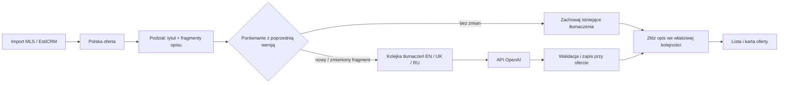

# Tłumaczenia treści ofert z polskiego przez OpenAI

Status: logika przygotowana lokalnie, 6 października 2026. Bez klucza API, migracji bazy i crona nie wykonuje jeszcze tłumaczeń. Nie została wdrożona na produkcję.

## Cel

Każda oferta z MLS lub EstiCRM zachowuje **oryginalny polski tytuł i opis**. Po imporcie ich tekst jest tłumaczony przez API OpenAI na angielski (`en`), ukraiński (`uk`) i rosyjski (`ru`). Wyniki zapisujemy przy konkretnej ofercie i pokazujemy w odpowiedniej wersji językowej portalu. Przy kolejnym eksporcie tłumaczymy **tylko nowy lub zmieniony tekst**; nie wysyłamy ponownie całego opisu ani pozostałych ofert.

To dotyczy treści ofert, a nie przycisków, nagłówków i innych tekstów interfejsu.

## Przepływ

1. Osobne zadanie `translate-offers.php --sync`, uruchamiane po imporcie, odczytuje polski `portalTitle` (lub obecny polski tytuł wyliczany przez API) oraz `descriptionWebsite`, z obecnym fallbackiem do `description`. Kluczem oferty jest `(source, source_id)`, więc identyczne numery z MLS i EstiCRM nie kolidują. Źródłowe `fields_json` pozostaje nietknięte.
2. Opis przechodzi przez obecny parser `descriptionDocument`. Jednostkami tłumaczenia są tytuł oraz **akapity, nagłówki i elementy list**; zachowujemy układ i znaczniki wyróżnienia. Jeśli zmieni się jedno zdanie, do API trafia jego akapit, a nie cały opis. Podział długich akapitów na mniejsze jednostki może być kolejnym usprawnieniem.
3. Każda jednostka ma identyfikator w obrębie oferty, kolejność, polski tekst i skrót treści. Przy kolejnym imporcie najpierw dopasowujemy **identyczny tekst niezależnie od pozycji**; gdy akapit zostanie przesunięty, jego przekład zostaje. Pozostałe fragmenty dopasowujemy do poprzedniej wersji w ramach struktury opisu. Jeśli zmienił się tylko jeden akapit, tylko jego skrót traci aktualność. Fragment usunięty znika ze składanej wersji, bez wywołania API. Niepewne dopasowanie traktujemy jako nowy fragment zamiast przypisywać mu cudzy przekład.
4. Dla nowego fragmentu worker zleca jego tłumaczenie na trzy języki. Przy edycji przekazuje **poprzedni polski tekst, nowy polski tekst i istniejące tłumaczenie tego fragmentu** z poleceniem aktualizacji; reszta opisu nie jest ponownie tłumaczona. Obecna implementacja wykonuje jedno wywołanie na zmieniony fragment i język.
5. Po walidacji zapisujemy EN/UK/RU razem z polskim skrótem jednostki. API i karta oferty składają wersję językową z aktualnych jednostek w kolejności obecnego polskiego opisu. Same zmiany ceny, zdjęć, statusu, powierzchni lub czasu eksportu nie uruchamiają tłumaczenia, jeśli nie zmieniły tytułu ani opisu.

Przykłady oczekiwanego zachowania:

| Zmiana w CRM | Tekst wysłany do OpenAI |
| --- | --- |
| Zmieniona tylko cena w osobnym polu | Nic |
| Zmieniony tytuł | Tylko tytuł × 3 języki |
| Dodany akapit | Tylko nowy akapit × 3 języki |
| Poprawione zdanie w jednym akapicie | Tylko zmieniony akapit × 3 języki, z poprzednim przekładem do aktualizacji |
| Usunięty lub przeniesiony akapit | Nic; zmienia się tylko składanie opisu |
| Ponowny import identycznego tekstu | Nic |

## Dane

Migracja dodaje cztery tabele obok `mls_offers`:

- `offer_translation_sources`: bieżące fragmenty PL, ich identyfikatory, skróty i układ opisu oraz identyfikator paczki, z którą zostały zsynchronizowane.
- `offer_translation_units`: przekłady pojedynczych fragmentów wraz z polskim tekstem źródłowym; poprzednie wersje zostają do aktualizacji kolejnych zmian.
- `offer_translation_jobs`: zadania tylko dla nowych lub zmienionych fragmentów, z ponowieniami błędów.
- `offer_translation_public`: złożona, kompletna wersja oferty dla danego języka, gotowa do szybkiego odczytu listy i karty.

Osobna kolejka `offer_translation_jobs` przechowuje identyfikatory zmienionych jednostek, język, oczekiwany `pl_hash`, liczbę prób i termin ponowienia. Unikalność dla oferty, jednostki, języka i skrótu zapobiega powielaniu pracy przy powtórnym imporcie. Worker ponownie sprawdza skrót przed wywołaniem API i przed zapisem wyniku; odpowiedź na przestarzałe zadanie jest odrzucana. Usunięta lub wycofana oferta nie jest publikowana niezależnie od pozostawionych tłumaczeń.

## Wywołanie OpenAI i kontrola wyniku

Prywatny worker (poza ruchem WWW) używa **OpenAI Responses API** z **Structured Outputs** i ścisłym schematem JSON zawierającym przetłumaczone fragmenty tekstu (`runs`). Kod sprawdza niepusty tekst, długość, poprawną strukturę i zachowanie chronionych wartości liczbowych, adresów e-mail oraz URL. Błędna lub niepełna odpowiedź trafia do ponowienia / diagnostyki, nigdy do publicznego odczytu. [Dokumentacja OpenAI: Structured Outputs](https://developers.openai.com/api/docs/guides/structured-outputs).

Klucz OpenAI jest tylko w prywatnej konfiguracji serwera. Worker ma limit prób i liczbę zadań na uruchomienie, a otwarcie karty oferty **nie wykonuje wywołania OpenAI**. Zwykła aktualizacja oferty nie rozpoczyna ponownego tłumaczenia wszystkich jednostek. Ewentualne odświeżenie przekładów po zmianie reguł jest osobną, świadomą operacją.

## Pokazywanie na stronie i kolejność wdrożenia

API przyjmuje `lang=en|uk|ru` i zwraca przekład tytułu/opisu tylko wtedy, gdy jest kompletny i dotyczy bieżącej paczki. Lista i karta korzystają z tego samego zapisanego zestawu tłumaczeń. **Wersja językowa oferty jest gotowa dopiero wtedy, gdy wszystkie bieżące jednostki jej tytułu i opisu mają aktualny przekład.** Do tego czasu treść oferty pozostaje w całości po polsku. Nie tworzymy indeksowalnych kart językowych bez gotowych tłumaczeń.

Do uruchomienia pozostają: migracja istniejącej bazy, wdrożenie prywatnego workera i publicznego API, dodanie klucza w prywatnym `config.php`, ustawienie crona po imporcie oraz pilotaż na kilku ofertach MLS i EstiCRM. Potem można tłumaczyć resztę **aktualnych** ofert stopniowo, limitem zadań na przebieg. Własne adresy kanoniczne i `hreflang` dla kart ofert wymagają osobnego etapu SEO. Backend API na Hostingerze wymaga osobnego wdrożenia od publicznej części witryny.

Warunek odbioru: na zmodyfikowanej ofercie można pokazać, które identyfikatory fragmentów trafiły do OpenAI, a które tłumaczenia zostały użyte ponownie; przy zmianie jednej jednostki liczba wywołań nie rośnie wraz z długością całego opisu ani liczbą ofert.
